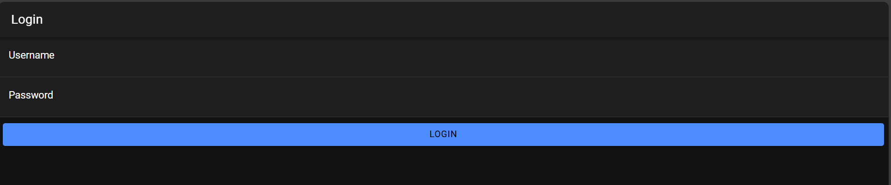
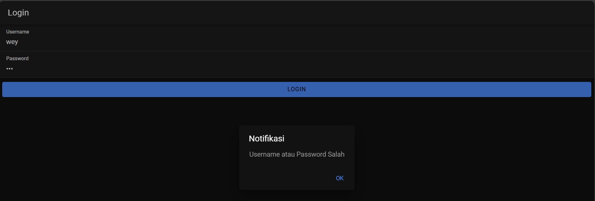
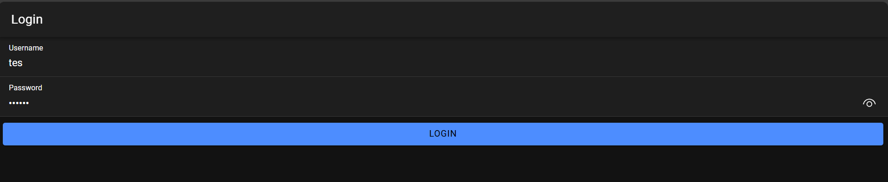

# Cara Kerja Login
## Proses Database 
Sebelum mengakses aplikasi, pengguna diharuskan untuk login terlebih dahulu dengan memasukkan username dan password pada form login yang tersedia. Setelah informasi dimasukkan, sistem akan mengecek ke database untuk memastikan kecocokan username dan password. Demi keamanan, password dalam database telah dilindungi dengan enkripsi MD5. Jika data yang dimasukkan benar, pengguna akan berhasil masuk ke aplikasi. Namun, jika terjadi kesalahan dalam username atau password, akses ditolak, dan pengguna harus mengulangi proses login.

## Alur Login
### Login BackEnd (MySQL)
Untuk menghubungkan aplikasi ke database MySQL, diperlukan file *koneksi.php*, yang bertugas mengatur koneksi ke database serta mengelola izin akses API dengan CORS (Cross-Origin Resource Sharing) agar aplikasi Ionic dapat mengaksesnya. Sementara itu, file *login.php* berfungsi memproses data login yang diterima dari pengguna. Dalam file ini, username dan password yang dikirimkan dari aplikasi Ionic akan diterima, dan password tersebut akan dienkripsi dalam format MD5 agar sesuai dengan data yang ada di database. Selanjutnya, dilakukan pengecekan melalui query SELECT untuk memvalidasi data pengguna. Jika data ditemukan, sistem akan membuat token yang menggabungkan waktu dan password, lalu mengirimkan respons berupa username, token, dan status login berhasil. Namun, jika data pengguna tidak ditemukan, sistem akan merespons dengan status login gagal.
### Login Ionic 
Pada file *authentication.service.ts*, perannya adalah mengelola proses login ke API PHP. Di dalamnya terdapat fungsi untuk menyimpan token dan username menggunakan *Preferences* sebagai penyimpanan lokal. File ini juga bertanggung jawab untuk mengatur status login pengguna serta menangani berbagai pesan error yang mungkin terjadi.

Di bagian *Guard*, ada dua file utama. *auth.guard.ts* berperan sebagai keamanan yang selalu mengecek apakah pengguna sudah login atau belum. Jika belum, pengguna akan diarahkan ke halaman login, namun jika sudah login, mereka akan diizinkan mengakses halaman *home*. Sementara itu, *auto-login.guard.ts* bekerja saat aplikasi pertama kali dibuka, dengan mengecek status login pengguna. Jika pengguna sudah login sebelumnya, mereka langsung diarahkan ke halaman *home*, tetapi jika belum, mereka akan tetap berada di halaman login.

Di halaman login (*login.page.ts*), proses login memiliki beberapa tahapan. Ketika pengguna menekan tombol login, sistem terlebih dahulu mengecek apakah username dan password sudah diisi. Jika ada yang kosong, akan muncul pesan error. Jika sudah diisi, data tersebut akan dikirim ke API PHP. Setelah mendapatkan respons dari API, jika login berhasil, maka token dan username disimpan, form login dikosongkan, dan pengguna diarahkan ke halaman *home*. Namun, jika login gagal, pesan "Username atau Password Salah" akan muncul. Apabila ada masalah dengan koneksi internet atau server lokal belum berjalan, pesan "Login Gagal Periksa Koneksi Internet" akan ditampilkan.

Pada halaman *home* (*home.page.ts*), nama pengguna yang sedang login akan ditampilkan. Tersedia juga tombol logout yang bisa digunakan untuk keluar dari aplikasi. Saat tombol ini ditekan, sistem akan menghapus token dan username dari penyimpanan, mengubah status login menjadi *false*, dan mengembalikan pengguna ke halaman login.

## Data yang tersimpan saat login
- Token: Disimpan dengan kunci `'auth-login'`
- Username: Disimpan dengan kunci `'auth-user'`

### Cara Penyimpanan
Data token dan username disimpan menggunakan *Capacitor Preferences* sebagai penyimpanan lokal, sehingga data akan tetap tersimpan bahkan jika aplikasi ditutup dan dibuka kembali. Data hanya akan hilang saat pengguna melakukan logout.

### Penghapusan Data
Data akan dihapus saat pengguna logout dengan memanfaatkan fungsi `clearData()` di *service*. Fungsi ini akan menghapus token dan username dari penyimpanan, memastikan bahwa informasi login tidak lagi tersimpan dan mengatur ulang status login pengguna.

## Keamanan
Berikut adalah rincian keamanan dan validasi dalam aplikasi:

- Password: Disimpan dalam database dengan enkripsi MD5 untuk meningkatkan keamanan data pengguna.
- Token: Digunakan untuk memvalidasi pengguna yang sudah login. Token ini disimpan secara lokal dan diperiksa setiap kali pengguna mengakses area yang membutuhkan autentikasi.
- Routes: Dilindungi menggunakan *Guard*, yang memastikan bahwa hanya pengguna yang telah login dapat mengakses halaman tertentu. Jika belum login, pengguna akan diarahkan ke halaman login.
- API: Dilindungi dengan *CORS* (Cross-Origin Resource Sharing) untuk mengatur akses dari aplikasi tertentu, mencegah permintaan yang tidak diotorisasi.
- Form Login: Dilengkapi dengan validasi input. Jika pengguna mencoba login tanpa mengisi username atau password, sistem akan menampilkan pesan error "Username atau Password Tidak Boleh Kosong". Validasi ini membantu memastikan bahwa hanya data yang lengkap yang dikirim ke server.

# ScreenShoot 

